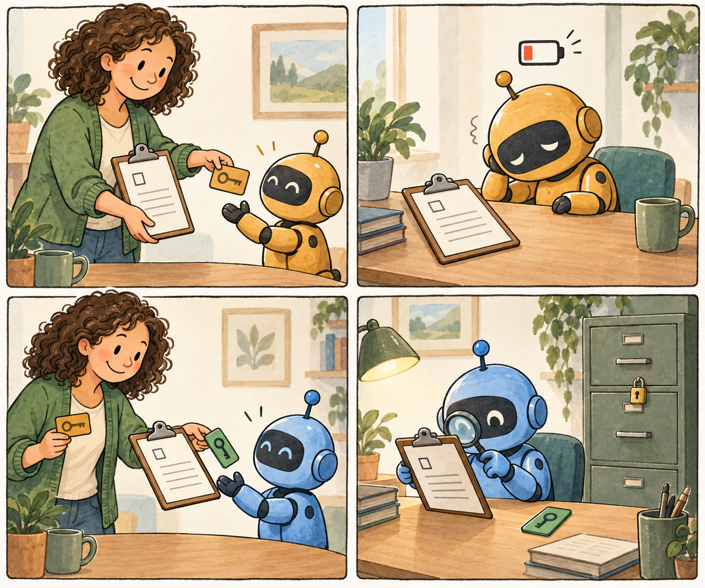

# Continuity — the helper can change. The job still matters.

*The main [README](README.md) has the technical overview. This companion takes the same route, with a story first. You can read it without installing anything.*

Imagine you ask a software helper, Alex, to look into a suspicious document. Alex gathers a packet of information, but stops before the review is finished. You bring in another helper, Bea.

Starting Bea is one job. Remembering what still needs doing—and deciding what Bea is allowed to touch—is another.



**The clipboard is the work. The card is permission. They are separate.**

Continuity keeps a record of the work, the people or programs assigned to it, and their permissions. In this example, Bea can review the packet Alex already gathered. Bea cannot gather another one unless separately allowed. If Bea loses permission to review, the unfinished job still appears in the record. Someone must decide how to get it done.

Alex and Bea are characters in our story. The tutorial calls its software helpers **A** and **B**. They are test identities, not AI models you need to install. The picture is an analogy: Continuity does not turn off a computer or physically lock a cabinet.

## Choose your path

| What sounds useful? | Start here |
| --- | --- |
| “Let me see why this matters.” | Keep reading, or open the [interactive story](https://continuity.ramex.com/). |
| “Can I try it on my computer?” | Follow the tutorial below. It uses made-up data. |
| “I want to connect this to my software.” | The [developer guide](docs/DEVELOPER.md) introduces the code and its limits. |

You do not need to take every path. Reading the story is a useful first step on its own.

## Run the tutorial

There are two ways to look: read an example that already happened, or make a new practice run. Neither needs a wallet, payment, AI account or real incident data.

For the commands below, use macOS or Linux with **Node 22.18 or later in the 22 series, 24, or 26**. Node is the program that runs this JavaScript example. If you are unsure what is installed, open your terminal and type `node --version`. A missing command or different version is a setup issue; [the setup guide](docs/QUICKSTART.md) and [troubleshooting page](docs/TROUBLESHOOTING.md) explain the next step. Native Windows instructions are not covered yet.

A terminal is the app where you type commands. Copy these two lines into it to download the public project with Git and enter its folder. No GitHub account is needed. If Git is unavailable, the [setup guide](docs/QUICKSTART.md) also explains the archive download.

```sh
git clone https://github.com/zerohourzulu/continuity.git
cd continuity
```

**First, read the saved example.** From that folder, run:

```sh
node examples/recorded.mjs
```

Look for **ALLOW** beside review and **DENY** beside collection. Bea may review the existing packet, but may not gather another. This command only reads a saved example; it does not carry out either action. You can stop here if that answers your question.

**Next, make a practice run:**

```sh
node tools/setup.mjs
node tutorial/start.mjs
```

The first command downloads the software dependencies at the versions this project uses, with their installation scripts disabled. The second runs the example locally using made-up data and public test keys. You do not need a separate pnpm installation or Python for this tutorial.

Near the end, expect **PASS — duty remains OPEN; B has no collection power**, followed by **VERIFIED** and a case name. `OPEN` means there is still work to do. `VERIFIED` means the saved history passed the example's checks; it does not mean the investigation is finished or the suspicious document really is dangerous.

The program prints commands for looking at your own case. Running it again makes a new case and leaves previous runs alone. If it stops with an error, read the message and try the [troubleshooting guide](docs/TROUBLESHOOTING.md); you do not need to erase earlier runs.

**Try changing just one thing:**

```sh
node tutorial/start.mjs --deny-review
```

Now Bea is still assigned the unfinished job, but cannot review the packet. That may sound inconvenient. It is useful information: being responsible for a job does not mean being allowed to do anything necessary to finish it. A person or service with the right authority needs to resolve that gap.

## Choose your holder of record.

Where should the record live? You can keep it locally. A deployment can also use a chain to make selected history publicly checkable. The tutorial here stays on your computer.

A chain is optional. It is not a place to put private documents by default. A real deployment needs to decide what gets recorded, who may see it, and how to recover it. The local example does not set up that deployment for you.

## Explore and build

| Your next question | Where to look |
| --- | --- |
| What do the answers mean? | [Read the result](docs/READ-THE-RESULT.md). |
| Can I inspect my own practice run? | [Operator guide](docs/OPERATOR.md). Here, “operator” means the person running the software. |
| How do I use the code? | [Developer guide](docs/DEVELOPER.md). |
| What about protecting real files on Linux? | [Optional Linux lab](docs/LINUX-LAB.md), with its own setup and limits. |
| What has actually been checked? | [Validation](VALIDATION.md), including what those checks do not establish. |
| Can I work on the website? | [Website guide](docs/WEBSITE.md). |

## Contribute and explore

A question, unclear sentence or small reproducible bug is a useful contribution. You do not have to propose a whole new system. [Contributing](CONTRIBUTING.md) explains how to ask or send a change. Please use made-up examples rather than private files or credentials.

For changes that affect permissions or how different programs work together, start a short public proposal—called an [RFC](docs/RFC.md)—so others can discuss the consequences. You can also [read how the project developed](docs/DEVELOPMENT-HISTORY.md).

## Scope

Continuity Core 0.2.2 is software you can try and study. It is not a ready-made security team or a cage around a hostile program.

The card in our drawing only helps if the door checks it. In real software, every protected action needs to go through the component that checks and carries out allowed requests. If a program can reach the same files using another password or route, Continuity's record alone will not stop it. That is part of the integration work, explained in [Security and limits](SECURITY.md).

The demonstration shows that unfinished work and permission can be tracked separately through a replacement. It does not promise that a job will get done, that a report is true, or that a compromised computer is safe.

The package includes the source, tutorial, tests and guides. See [what is included](docs/PACKAGE-OVERVIEW.md), [release status](RELEASE-STATUS.md), the [Apache 2.0 license](LICENSE) and [third-party notices](THIRD-PARTY-NOTICES.md).

## Embed the engine

If you build software, you can use the small [JavaScript developer package](docs/SDK-QUICKSTART.md) in a separate application. Its example copies a made-up packet only after the request passes the required checks. You can see both the successful path and requests that produce no copy.

The package also includes TypeScript descriptions of its interfaces. You can leave that detail until you need it. The next useful step is simply to run the example and compare its result with what you expected.

*Illustration made with AI assistance for this guide. [Art notes and prompt](docs/ELI5-ILLUSTRATION.md).*

## Ready to try your own little case?

The [Core0.3 quickstart](docs/CORE-0.3-QUICKSTART.md) gives an agent permission, takes it away, and shows that reopening its saved work does not bring that permission back. If you want a tool that actually checks before copying a few example files, try the [MCP demo](docs/MCP-PACKAGE.md). Both use made-up case data; no model account is needed.
