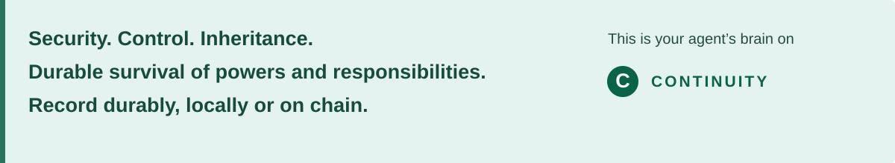

[](https://zerohourzulu.github.io/continuity/)
[](https://zerohourzulu.github.io/continuity/)

# Continuity — agents change; responsibility remains

**[Explore the interactive demo →](https://zerohourzulu.github.io/continuity/)** · [Start here](docs/START-HERE.md) · [Developer guide](docs/DEVELOPER.md) · [Security and limits](SECURITY.md)

**Public evaluation release · Apache 2.0.** [Release status](RELEASE-STATUS.md).

A process supervisor can start Agent B. Continuity records which role B occupies, which powers it has, what happened before, and which unfinished duties survive the change. A replacement receives its explicitly granted powers; an unfinished duty does not silently grant more authority.

The demonstration follows a security investigation interrupted by an agent replacement. The old request is refused, the investigation stays OPEN, and the successor’s review permission is checked independently.

## Run the tutorial

Use **Node.js 24.x and pnpm 11.19.0** on macOS or Linux. Extract the supplied package (or clone this repository), then run:

```sh
pnpm install --frozen-lockfile --ignore-scripts
node tools/verify-package.mjs
node tutorial/cli.mjs run --case first-look
node tutorial/cli.mjs inspect first-look
```

Expected result: **PASS — duty remains OPEN; B has no collection power.** No wallet, AI subscription, chain node or background service is needed. Installation downloads locked dependencies; the tutorial then runs locally using synthetic data and declared public test keys.

Change one permission:

```sh
node tutorial/cli.mjs run --case no-review-power --successor-review deny
node tutorial/cli.mjs inspect no-review-power
```

B still receives the duty, but its permission to review changes to DENY. [Full tutorial and expected output](docs/TUTORIAL.md) · [Setup help](docs/TROUBLESHOOTING.md).

## Choose your holder of record.

Keep records locally, or choose a chain-backed deployment to make selected history publicly verifiable. Cryptographic commitments can let authorized reviewers check private records without publishing their contents. This tutorial runs locally; each deployment has its own privacy, availability and finality requirements.

## Explore and build

| Your next step | Where to go |
|---|---|
| See the idea and recorded comparison | [Interactive demo](https://zerohourzulu.github.io/continuity/) |
| Inspect recorded Linux evidence | [Operator guide](docs/OPERATOR.md) |
| Integrate an authority check | [Developer guide](docs/DEVELOPER.md) · [Executable example](examples/check-authority.mjs) |
| Try optional native enforcement mechanics | [Disposable Linux lab](docs/LINUX-LAB.md) |
| Review source provenance and validation | [Validation](VALIDATION.md) · [Presentation checks](docs/PRESENTATION-VALIDATION.md) · [Provenance](SOURCE-PROVENANCE.json) |
| Extend the presentation | [Website maintenance](docs/WEBSITE.md) |

The [evolving Sites edition](https://continuity-core-demo.zero-hour-zulu.chatgpt.site/) is currently private to its owner and may develop independently. GitHub Pages is the public walkthrough; no Sites account is needed to use Pages or the local tutorial.

## Principles and development

Read the [Constitution and plain-language introduction](docs/constitution/README.md), or the [short development history](docs/DEVELOPMENT-HISTORY.md) from Core 0.1 to the current reference implementation.

## Scope

Core 0.2.2 is local reference software. It is not a hostile-agent sandbox, production credential system or autonomous cyber defender. The website selects recorded results; the downloaded tutorial executes Core. Real integrations must mediate every consequential operation through a protected executor. [Security boundaries](SECURITY.md).

The source, tutorial and website are included here. The website’s download retains the accepted public evaluation R3 archive; this repository adds the latest presentation around that same unchanged runtime. [Package overview](docs/PACKAGE-OVERVIEW.md) · [Presentation provenance](PRESENTATION-PROVENANCE.json).

[Release status and licensing](RELEASE-STATUS.md) · [Apache 2.0 license](LICENSE) · [Third-party notices](THIRD-PARTY-NOTICES.md)
